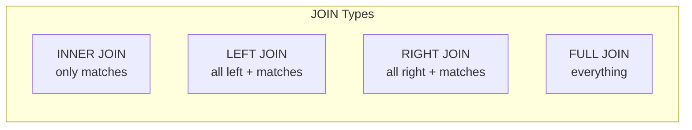

# 🎯 MISSION 04 — Sales Dashboard Emergency

```
┌────────────────────────────────────────────────────────────────────┐
│  LEVEL 2: Reporting Analyst                                        │
│  XP AVAILABLE: 800                                                │
│  CONCEPTS: INNER · LEFT · RIGHT · FULL · CROSS · SELF JOIN        │
│  ESTIMATED TIME: 75 minutes                                       │
└────────────────────────────────────────────────────────────────────┘
```

---

## 📧 The Urgent Message

> **From:** Robert Lee (VP Sales)
> **To:** You (Reporting Analyst)
> **Subject:** 🚨 Revenue dashboard is wrong — numbers don't add up
>
> *"Our sales dashboard shows order IDs and customer IDs — just meaningless numbers! The board wants to see customer NAMES, which sales rep closed each deal, and what PRODUCTS were sold.*
>
> *The data is all there, but it's spread across different tables: orders, customers, employees, products. I need you to connect them.*
>
> *Also — some orders might not have a customer linked, and some customers haven't ordered anything yet. I need to see ALL of these cases, not lose any data.*
>
> *This is the most important skill in your job. Get it right.*
>
> *— Robert"*

---

## 🧭 Why This Matters (The Real World)

Real databases **never** store everything in one table. Data is split into related tables (this is called *normalization*).

- `customers` — who they are
- `orders` — what they bought
- `employees` — who sold it
- `products` — what was sold

**JOINs** reconnect this data. They are the #1 most important SQL skill and the #1 most common interview topic.

| Role | How they use JOINs |
|------|---------------------|
| **Analyst** | Combines fact + dimension tables for every report |
| **Data Engineer** | Joins source systems in ETL pipelines |
| **Analytics Engineer** | Builds joined data models in dbt |
| **Architect** | Designs the keys that make JOINs possible |
| **AI Engineer** | Joins features from multiple tables for ML |

---

## 🖼️ Visualizing JOINs



```
INNER JOIN          LEFT JOIN           RIGHT JOIN          FULL JOIN
   A ∩ B            A + (A ∩ B)         (A ∩ B) + B         A ∪ B
  ┌───┬───┐         ┌───┬───┐           ┌───┬───┐           ┌───┬───┐
  │   │███│         │███│███│           │   │███│           │███│███│
  │ A │███│ B       │ A │███│ B         │ A │███│ B         │███│███│
  │   │███│         │███│███│           │   │███│           │███│███│
  └───┴───┘         └───┴───┘           └───┴───┘           └───┴───┘
  Keep only         Keep all A          Keep all B          Keep all
  matching rows     + matches           + matches           rows
```

---

## 📚 Concept 1 — INNER JOIN

Returns **only rows that match** in both tables.

```sql
-- Show orders WITH their customer names
SELECT 
    o.order_id,
    c.company_name,
    o.order_date,
    o.order_status
FROM orders o
INNER JOIN customers c ON o.customer_id = c.customer_id
ORDER BY o.order_date;
```

**Breaking it down:**
- `orders o` — the orders table, aliased as `o`
- `INNER JOIN customers c` — connect to customers, aliased as `c`
- `ON o.customer_id = c.customer_id` — the matching condition (the "join key")

> 💡 **Table aliases** (`o`, `c`) keep queries short. Always use them with JOINs.

If an order has a `customer_id` that doesn't exist in customers, INNER JOIN **drops** that row.

### Joining Three+ Tables

```sql
-- Orders + customer name + sales rep name
SELECT 
    o.order_id,
    c.company_name           AS customer,
    e.first_name || ' ' || e.last_name AS sales_rep,
    o.order_date,
    o.order_status
FROM orders o
INNER JOIN customers c ON o.customer_id = c.customer_id
INNER JOIN employees e ON o.sales_rep_id = e.employee_id
ORDER BY o.order_date;
```

You can chain as many JOINs as you need.

### Joining Four Tables (Full Order Detail)

```sql
-- Complete picture: order + customer + rep + product
SELECT 
    o.order_id,
    c.company_name           AS customer,
    e.last_name              AS rep,
    p.product_name,
    oi.quantity,
    oi.line_total
FROM orders o
INNER JOIN customers c   ON o.customer_id = c.customer_id
INNER JOIN employees e   ON o.sales_rep_id = e.employee_id
INNER JOIN order_items oi ON o.order_id = oi.order_id
INNER JOIN products p     ON oi.product_id = p.product_id
ORDER BY o.order_id;
```

This single query answers Robert's entire request.

---

## 📚 Concept 2 — LEFT JOIN

Returns **all rows from the left table**, plus matches from the right. Non-matches show `NULL`.

```sql
-- ALL customers, even those who never ordered
SELECT 
    c.company_name,
    o.order_id,
    o.order_date
FROM customers c
LEFT JOIN orders o ON c.customer_id = o.customer_id
ORDER BY c.company_name;
```

Customers with no orders still appear — with `NULL` order fields.

### The Killer Use Case — Finding "Missing" Data

```sql
-- Which customers have NEVER placed an order? (sales opportunity!)
SELECT 
    c.company_name,
    c.customer_status
FROM customers c
LEFT JOIN orders o ON c.customer_id = o.customer_id
WHERE o.order_id IS NULL;
```

This `LEFT JOIN ... WHERE right IS NULL` pattern is **extremely common** — it finds records that *don't* have a match. Memorize it.

---

## 📚 Concept 3 — RIGHT JOIN

The mirror of LEFT JOIN: all rows from the **right** table, plus matches from the left.

```sql
-- All employees, even those who never made a sale
SELECT 
    e.first_name,
    e.last_name,
    o.order_id
FROM orders o
RIGHT JOIN employees e ON o.sales_rep_id = e.employee_id
ORDER BY e.last_name;
```

> 💡 In practice, most people just use LEFT JOIN and reorder the tables. `A RIGHT JOIN B` = `B LEFT JOIN A`. But you should recognize RIGHT JOIN in others' code.

---

## 📚 Concept 4 — FULL OUTER JOIN

Returns **everything** from both tables — matches plus all non-matches from both sides.

```sql
-- Every customer and every order, matched where possible
SELECT 
    c.company_name,
    o.order_id,
    o.order_status
FROM customers c
FULL OUTER JOIN orders o ON c.customer_id = o.customer_id
ORDER BY c.company_name NULLS LAST;
```

Use it when you need to reconcile two datasets and can't lose anything from either side — e.g., comparing two systems during a migration.

---

## 📚 Concept 5 — CROSS JOIN

Returns the **Cartesian product** — every row of A combined with every row of B.

```sql
-- Every product matched with every region (for a planning grid)
SELECT 
    p.product_name,
    r.region
FROM products p
CROSS JOIN (VALUES ('East'), ('West'), ('Central')) AS r(region);
```

If A has 42 rows and B has 3, you get 126 rows. Useful for generating combinations (e.g., date × product matrices). **Use with caution** — it can explode row counts.

---

## 📚 Concept 6 — SELF JOIN

Join a table **to itself** — perfect for hierarchies like manager/employee.

```sql
-- Show each employee alongside their manager's name
SELECT 
    e.first_name || ' ' || e.last_name AS employee,
    e.job_title,
    m.first_name || ' ' || m.last_name AS manager
FROM employees e
LEFT JOIN employees m ON e.manager_id = m.employee_id
ORDER BY manager;
```

Here the **same table** appears twice with two aliases: `e` (employee) and `m` (manager). The CEO has no manager, so a `LEFT JOIN` keeps them (with NULL manager).

---

## ✅ Solving the Sales Emergency

```sql
-- The complete revenue dashboard query
SELECT 
    o.order_id,
    c.company_name                       AS customer,
    e.first_name || ' ' || e.last_name   AS sales_rep,
    p.product_name,
    oi.quantity,
    oi.line_total                        AS revenue,
    o.order_status
FROM orders o
INNER JOIN customers c    ON o.customer_id = c.customer_id
INNER JOIN employees e    ON o.sales_rep_id = e.employee_id
INNER JOIN order_items oi ON o.order_id = oi.order_id
INNER JOIN products p     ON oi.product_id = p.product_id
ORDER BY o.order_date DESC;

-- Plus: customers who haven't ordered (opportunities)
SELECT c.company_name, c.contract_tier
FROM customers c
LEFT JOIN orders o ON c.customer_id = o.customer_id
WHERE o.order_id IS NULL;
```

---

## 🏋️ Exercises

1. INNER JOIN `employees` with `departments` to show each employee's name and `department_name`.
2. LEFT JOIN `customers` with `orders` to count how many orders each customer has placed (hint: `COUNT(o.order_id)` + `GROUP BY`).
3. Find all employees and their department name, including any employee whose department might be missing (LEFT JOIN).
4. Use a SELF JOIN to list every employee and their manager's `job_title`.
5. Find products that have **never** been ordered (LEFT JOIN `products` to `order_items`, filter `IS NULL`).
6. Join `orders`, `customers`, and `employees` to show order_id, customer name, and rep name for all `Delivered` orders.
7. Count total revenue (`SUM(line_total)`) per customer by joining `orders` → `order_items` → `customers`, grouped by company name.
8. Find which sales rep generated the most total revenue (join + GROUP BY + ORDER BY + LIMIT).

→ Solutions: [SOLUTIONS/MISSION-04.md](../../SOLUTIONS/MISSION-04.md)

---

## 🧪 Quiz

→ [QUIZZES/MISSION-04-quiz.md](../../QUIZZES/MISSION-04-quiz.md)

---

## 🔥 Challenge (Bonus 150 XP)

> Robert asks: *"Build the executive sales summary: for each sales rep, show their full name, the number of distinct customers they've sold to, their total revenue, and their average order value. Only include reps with total revenue above $50,000, sorted by total revenue descending."*

**Hints:** Join `employees` → `orders` → `order_items`. Use `COUNT(DISTINCT o.customer_id)`, `SUM(oi.line_total)`, and `HAVING`.

---

## 🎓 What You Learned

```
✓ INNER JOIN — only matching rows
✓ LEFT JOIN — all left rows + matches
✓ RIGHT JOIN — all right rows + matches
✓ FULL OUTER JOIN — everything
✓ CROSS JOIN — Cartesian product
✓ SELF JOIN — join a table to itself (hierarchies)
✓ Table aliases (o, c, e, p)
✓ The "LEFT JOIN ... WHERE IS NULL" anti-join pattern
✓ Joining 3, 4, or more tables
```

**XP EARNED: 800** (+150 bonus for the challenge)

---

## ➡️ Next Mission

Marketing wants to find their best customers using queries inside queries...

→ [MISSION 05 — Marketing Customer Intelligence](../MISSION-05/README.md)
