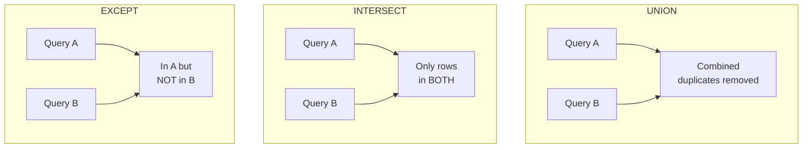

# 🎯 MISSION 08 — Enterprise Reporting Architecture

```
┌────────────────────────────────────────────────────────────────────┐
│  LEVEL 4: Data Engineer                                            │
│  XP AVAILABLE: 500                                                │
│  CONCEPTS: UNION · UNION ALL · INTERSECT · EXCEPT                 │
│  ESTIMATED TIME: 50 minutes                                       │
└────────────────────────────────────────────────────────────────────┘
```

---

## 📧 The Challenge

> **From:** Nicholas Richardson (Head of Data Engineering)
> **To:** You (Data Engineer)
> **Subject:** Consolidating data from multiple systems
>
> *"Welcome to Data Engineering! Your first real challenge:*
>
> *We have employees and contractors in separate tracking systems. I need a single unified contact list.*
>
> *I also need to compare two lists: who's in our active employee list AND in the learning system? Who's an employee but has NEVER enrolled in training?*
>
> *This is set theory applied to data. You'll use it constantly in pipelines.*
>
> *— Nicholas"*

---

## 🧭 Why This Matters (The Real World)

Set operations combine the **results of two queries** vertically (stacking rows), unlike JOINs which combine horizontally (adding columns).

They're essential when:
- Merging data from multiple sources (mergers, multi-region systems)
- Comparing datasets (reconciliation, data quality, migration validation)
- Building "union all sources" patterns in pipelines

| Role | How they use set operations |
|------|------------------------------|
| **Data Engineer** | Union data from multiple source tables |
| **Analyst** | Combine current + historical datasets |
| **Architect** | Reconcile systems during migrations |
| **Analytics Engineer** | Stack staged models in dbt |

---

## 📐 The Rules of Set Operations

For any set operation, both queries must have:
1. The **same number of columns**
2. **Compatible data types** in each position
3. Column names come from the **first** query



---

## 📚 Concept 1 — UNION and UNION ALL

`UNION` stacks two result sets and **removes duplicates**.
`UNION ALL` stacks them and **keeps duplicates** (faster).

```sql
-- Unified contact list: full-time employees + contractors
SELECT first_name, last_name, email, 'Employee' AS type
FROM employees
WHERE employment_type = 'Full-Time'

UNION

SELECT first_name, last_name, email, 'Contractor' AS type
FROM employees
WHERE employment_type = 'Contract';
```

```sql
-- UNION ALL — keeps every row, even duplicates (faster, no dedup)
SELECT location FROM employees
UNION ALL
SELECT location FROM customers WHERE country = 'USA';
```

### UNION vs UNION ALL — Critical Performance Note

| | UNION | UNION ALL |
|--|-------|-----------|
| Removes duplicates? | Yes | No |
| Speed | Slower (must sort/dedup) | Faster |
| Use when | You need unique rows | You know there are no dups, or want all |

> 💡 **Default to `UNION ALL`** unless you specifically need duplicate removal. The dedup step in `UNION` is expensive on large datasets. This is a common performance interview question.

---

## 📚 Concept 2 — INTERSECT

Returns only rows that appear in **both** queries.

```sql
-- Employees who are BOTH active AND have enrolled in learning
SELECT employee_id FROM employees WHERE status = 'Active'
INTERSECT
SELECT employee_id FROM learning_enrollments;
```

The result: employee IDs present in both sets. Great for "who is in both systems?" questions.

---

## 📚 Concept 3 — EXCEPT

Returns rows in the **first** query that are **not** in the second. (Some databases call this `MINUS`.)

```sql
-- Active employees who have NEVER enrolled in any training
SELECT employee_id FROM employees WHERE status = 'Active'
EXCEPT
SELECT employee_id FROM learning_enrollments;
```

`EXCEPT` is a clean way to find "what's missing" — a powerful alternative to `NOT IN` / `NOT EXISTS`.

> 💡 Like UNION, both `INTERSECT` and `EXCEPT` remove duplicates by default. Use `INTERSECT ALL` / `EXCEPT ALL` to keep them.

---

## 🔬 Set Operations vs JOINs — When to Use Which

| Goal | Use |
|------|-----|
| Add columns from another table | JOIN |
| Stack rows from two queries | UNION |
| Find rows in both sets | INTERSECT (or INNER JOIN) |
| Find rows in A but not B | EXCEPT (or LEFT JOIN ... IS NULL) |

---

## ✅ Solving the Data Engineering Request

```sql
-- 1. Unified contact list
SELECT first_name, last_name, email, employment_type FROM employees
WHERE employment_type IN ('Full-Time', 'Contract')
ORDER BY last_name;

-- 2. Employees in BOTH active list and learning system
SELECT employee_id FROM employees WHERE status = 'Active'
INTERSECT
SELECT employee_id FROM learning_enrollments;

-- 3. Active employees with NO training
SELECT employee_id FROM employees WHERE status = 'Active'
EXCEPT
SELECT employee_id FROM learning_enrollments;
```

---

## 🏋️ Exercises

1. `UNION` employee locations and customer cities into one distinct list of places.
2. Use `UNION ALL` to combine all `Full-Time` and all `Part-Time` employee names with a label column.
3. Use `INTERSECT` to find `department_id` values that appear in both `employees` and `finance_budget`.
4. Use `EXCEPT` to find products (`product_id`) that exist in `products` but never in `order_items`.
5. Combine three queries with `UNION`: employees from Austin, Chicago, and Dallas, each labeled with their city.
6. Find customers (`customer_id`) who placed orders in both 2023 and 2024 using `INTERSECT`.
7. Find customers who ordered in 2023 but NOT in 2024 using `EXCEPT`.

→ Solutions: [SOLUTIONS/MISSION-08.md](../../SOLUTIONS/MISSION-08.md)

---

## 🧪 Quiz

→ [QUIZZES/MISSION-08-quiz.md](../../QUIZZES/MISSION-08-quiz.md)

---

## 🔥 Challenge (Bonus 75 XP)

> Nicholas asks: *"Build a data reconciliation report. Show three categories in one result set: (a) employees in both the active roster and learning system, (b) active employees missing from learning, (c) learning records with no matching active employee. Label each category."*

**Hint:** Use `UNION ALL` to stack three labeled queries (one INTERSECT-style, two EXCEPT-style).

---

## 🎓 What You Learned

```
✓ UNION — stack rows, remove duplicates
✓ UNION ALL — stack rows, keep duplicates (faster)
✓ INTERSECT — rows in both queries
✓ EXCEPT — rows in first but not second
✓ Column count/type compatibility rules
✓ Set operations vs JOINs
✓ Performance: prefer UNION ALL when possible
```

**XP EARNED: 500** (+75 bonus for the challenge)

---

## ➡️ Next Mission

Production queries are timing out. The CTO needs you to make them fast...

→ [MISSION 09 — Database Performance Crisis](../MISSION-09/README.md)
