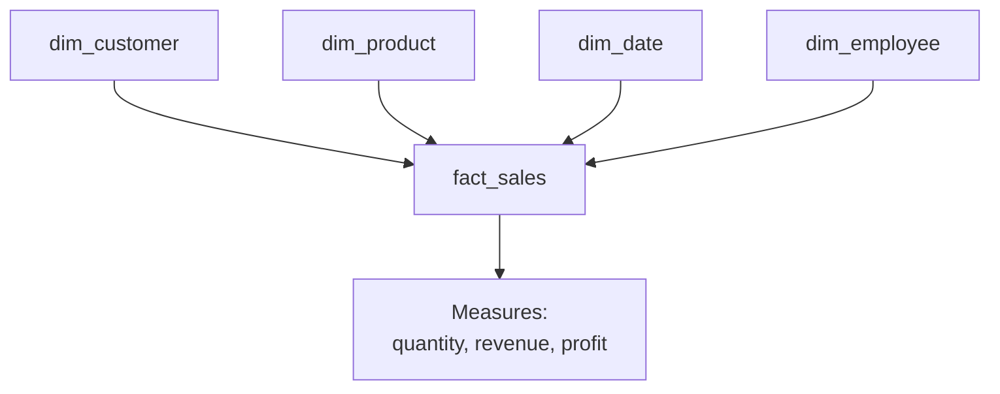
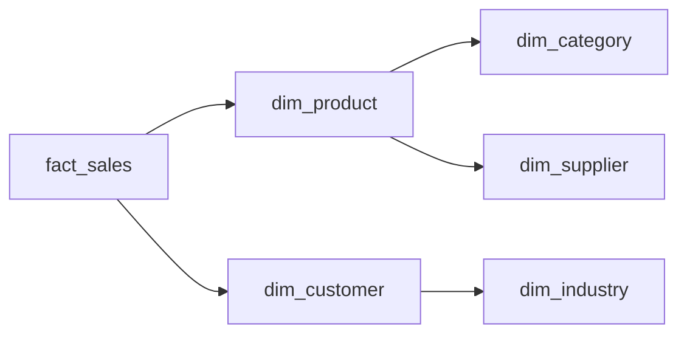

# 🎯 MISSION 10 — Data Warehouse Design

```
┌────────────────────────────────────────────────────────────────────┐
│  LEVEL 6: Snowflake Developer (in training)                        │
│  XP AVAILABLE: 1200                                              │
│  CONCEPTS: Fact/Dimension Tables · Star Schema · Snowflake Schema │
│            · SCD Type 1 · SCD Type 2 · Bridge & Junk Dimensions   │
│  ESTIMATED TIME: 100 minutes                                      │
└────────────────────────────────────────────────────────────────────┘
```

---

## 📧 The Project

> **From:** Angela Davis (CDO) & Marcus Thompson (CTO)
> **To:** You (Senior Data Engineer → Architect track)
> **Subject:** Design our analytics data warehouse
>
> *"Our operational database (the one you've been using) is great for running the business, but it's the WRONG shape for analytics. Joining 6 tables for every dashboard is slow and confusing.*
>
> *We're building a proper data warehouse. We need you to design a star schema: fact tables for the measurable events (sales) and dimension tables for the context (customer, product, date, employee).*
>
> *Critically — when a customer changes their address or tier, we need to track history. The board wants 'what was their tier at the time of each sale', not just today's tier.*
>
> *— Angela & Marcus"*

---

## 🧭 Why This Matters (The Real World)

The database you've used so far is **OLTP** (Online Transaction Processing) — optimized for fast writes and running the business. It's highly normalized (data split across many tables).

A **data warehouse** is **OLAP** (Online Analytical Processing) — optimized for fast reads and analytics. It's denormalized into a **star schema**.

This is the foundation of Snowflake, BigQuery, Redshift, and every BI tool. Understanding dimensional modeling is what makes you a **Data Architect**.

| Concept | OLTP (operational) | OLAP (warehouse) |
|---------|-------------------|-------------------|
| Goal | Run the business | Analyze the business |
| Shape | Normalized (many tables) | Star schema (fact + dims) |
| Optimized for | Writes | Reads/aggregations |
| Example | The `orders` table | A `fact_sales` table |

---

## 📚 Concept 1 — Fact and Dimension Tables



- **Fact table** — stores **measurable events** (numbers you sum/average): sales, clicks, transactions. Contains *foreign keys* to dimensions + *measures*.
- **Dimension table** — stores **descriptive context** (the "who, what, where, when"): customers, products, dates, employees.

> The rule of thumb: **if you'd SUM or COUNT it, it's a fact. If you'd GROUP BY or FILTER on it, it's a dimension.**

---

## 📚 Concept 2 — Star Schema

The classic design: one central fact table surrounded by dimension tables, like a star.

```sql
-- DIMENSION: Customer
CREATE TABLE dim_customer (
    customer_key   SERIAL PRIMARY KEY,   -- surrogate key
    customer_id    INT,                  -- natural/business key
    company_name   VARCHAR(200),
    industry       VARCHAR(100),
    company_size   VARCHAR(20),
    country        VARCHAR(50),
    contract_tier  VARCHAR(20)
);

-- DIMENSION: Product
CREATE TABLE dim_product (
    product_key    SERIAL PRIMARY KEY,
    product_id     INT,
    product_name   VARCHAR(200),
    category       VARCHAR(50),
    subcategory    VARCHAR(50)
);

-- DIMENSION: Date
CREATE TABLE dim_date (
    date_key       INT PRIMARY KEY,      -- e.g. 20240115
    full_date      DATE,
    year           INT,
    quarter        INT,
    month          INT,
    month_name     VARCHAR(20),
    day_of_week    VARCHAR(20),
    is_weekend     BOOLEAN
);

-- DIMENSION: Employee (sales rep)
CREATE TABLE dim_employee (
    employee_key   SERIAL PRIMARY KEY,
    employee_id    INT,
    full_name      VARCHAR(100),
    department     VARCHAR(100),
    location       VARCHAR(100)
);

-- FACT: Sales
CREATE TABLE fact_sales (
    sale_key       BIGSERIAL PRIMARY KEY,
    date_key       INT  REFERENCES dim_date(date_key),
    customer_key   INT  REFERENCES dim_customer(customer_key),
    product_key    INT  REFERENCES dim_product(product_key),
    employee_key   INT  REFERENCES dim_employee(employee_key),
    -- Measures (the numbers we analyze)
    quantity       INT,
    unit_price     NUMERIC(12,2),
    revenue        NUMERIC(12,2),
    cost           NUMERIC(12,2),
    gross_profit   NUMERIC(12,2)
);
```

### Why Surrogate Keys?

Notice `customer_key` (a meaningless auto-increment) vs `customer_id` (the real business ID). Warehouses use **surrogate keys** because:
- They're stable even if business IDs change.
- They enable **slowly changing dimensions** (next concept).
- They're compact integers — fast joins.

### Querying a Star Schema (Simple & Fast)

```sql
-- Revenue by product category and quarter — clean and fast
SELECT 
    p.category,
    d.year,
    d.quarter,
    SUM(f.revenue) AS total_revenue
FROM fact_sales f
JOIN dim_product p ON f.product_key = p.product_key
JOIN dim_date    d ON f.date_key = d.date_key
GROUP BY p.category, d.year, d.quarter
ORDER BY d.year, d.quarter, total_revenue DESC;
```

Every analytical query follows this pattern: fact + a few dimensions. Far simpler than joining the operational tables.

---

## 📚 Concept 3 — Snowflake Schema

A **snowflake schema** normalizes dimensions into sub-dimensions (the star's points "snowflake" out).



```sql
-- Instead of category text in dim_product, reference a category dimension
CREATE TABLE dim_category (
    category_key  SERIAL PRIMARY KEY,
    category_name VARCHAR(50),
    category_group VARCHAR(50)
);

CREATE TABLE dim_product_snowflaked (
    product_key  SERIAL PRIMARY KEY,
    product_name VARCHAR(200),
    category_key INT REFERENCES dim_category(category_key)  -- normalized!
);
```

| | Star Schema | Snowflake Schema |
|--|-------------|-------------------|
| Dimensions | Denormalized (flat) | Normalized (sub-tables) |
| Query speed | Faster (fewer joins) | Slower (more joins) |
| Storage | More redundancy | Less redundancy |
| Simplicity | Simpler | More complex |
| Recommended | **Usually preferred** | When dimensions are huge |

> 💡 Despite the company name, Snowflake (the cloud DW) actually recommends **star schemas** for performance. The "snowflake schema" is a separate concept.

---

## 📚 Concept 4 — Slowly Changing Dimensions (SCD)

Dimensions change over time — a customer moves, gets upgraded, changes name. How you handle this is critical.

### SCD Type 1 — Overwrite (No History)

Just update the value. You lose the old value forever.

```sql
-- Customer upgraded from 'Growth' to 'Business' — overwrite
UPDATE dim_customer
SET contract_tier = 'Business'
WHERE customer_id = 13;
```

**Use when:** the old value doesn't matter (e.g., correcting a typo, updating a phone number).

### SCD Type 2 — Track Full History

Add new rows with validity dates. Keeps the complete history.

```sql
CREATE TABLE dim_customer_scd2 (
    customer_key   SERIAL PRIMARY KEY,
    customer_id    INT,                 -- business key (repeats)
    company_name   VARCHAR(200),
    contract_tier  VARCHAR(20),
    -- SCD Type 2 tracking columns
    valid_from     DATE NOT NULL,
    valid_to       DATE,                -- NULL = current version
    is_current     BOOLEAN DEFAULT TRUE
);

-- Initial record
INSERT INTO dim_customer_scd2 (customer_id, company_name, contract_tier, valid_from, valid_to, is_current)
VALUES (13, 'FinTech Ventures', 'Growth', '2021-04-01', NULL, TRUE);

-- Customer upgrades on 2024-01-01 — SCD Type 2 process:
-- Step 1: close out the old version
UPDATE dim_customer_scd2
SET valid_to = '2023-12-31', is_current = FALSE
WHERE customer_id = 13 AND is_current = TRUE;

-- Step 2: insert the new version
INSERT INTO dim_customer_scd2 (customer_id, company_name, contract_tier, valid_from, valid_to, is_current)
VALUES (13, 'FinTech Ventures', 'Business', '2024-01-01', NULL, TRUE);
```

Now you can answer *"what tier was this customer when the sale happened?"*:

```sql
-- Point-in-time lookup
SELECT contract_tier
FROM dim_customer_scd2
WHERE customer_id = 13
  AND '2023-06-15' BETWEEN valid_from AND COALESCE(valid_to, '9999-12-31');
```

This directly answers the board's requirement. **SCD Type 2 is one of the most important data engineering concepts** and a guaranteed interview topic.

| SCD Type | Behavior | History? |
|----------|----------|----------|
| Type 0 | Never changes | N/A |
| **Type 1** | Overwrite | No |
| **Type 2** | New row + dates | Full |
| Type 3 | Add "previous value" column | Limited (1 prior) |

---

## 📚 Concept 5 — Bridge Tables & Junk Dimensions

### Bridge Table (Many-to-Many)

When a fact relates to a dimension in a many-to-many way (e.g., an order with multiple sales reps, or a product in multiple categories), a bridge table resolves it.

```sql
CREATE TABLE bridge_order_rep (
    order_key    INT,
    employee_key INT,
    allocation_pct NUMERIC(5,2)   -- split credit between reps
);
```

### Junk Dimension

Combines several low-cardinality flags (yes/no, small lists) into one small dimension to avoid cluttering the fact table.

```sql
-- Instead of 4 flag columns in the fact table
CREATE TABLE dim_order_flags (
    flag_key       SERIAL PRIMARY KEY,
    is_rush        BOOLEAN,
    is_gift        BOOLEAN,
    payment_method VARCHAR(30),
    shipping_method VARCHAR(30)
);
-- fact_sales just stores one flag_key
```

---

## 🏋️ Exercises

1. Identify which of these are facts vs dimensions: `revenue`, `customer_name`, `quantity`, `product_category`, `order_date`, `gross_profit`.
2. Create a `dim_date` table and populate it for all of 2024 using `generate_series`.
3. Build `fact_sales` by joining the operational `sales_transactions` to your dimensions (an ETL "load" step).
4. Write a star-schema query: total revenue by `industry` and `quarter`.
5. Perform an SCD Type 1 update: change a product's category.
6. Implement an SCD Type 2 change for an employee who relocated from Austin to Dallas. Show both the old (closed) and new (current) rows.
7. Write a point-in-time query against your SCD Type 2 table to find a customer's tier on a specific historical date.
8. Design (DDL only) a junk dimension combining `payment_status` and `shipping_method`.

→ Solutions: [SOLUTIONS/MISSION-10.md](../../SOLUTIONS/MISSION-10.md)

---

## 🧪 Quiz

→ [QUIZZES/MISSION-10-quiz.md](../../QUIZZES/MISSION-10-quiz.md)

---

## 🔥 Challenge (Bonus 250 XP)

> *"Design and implement a complete star schema for DataVerse sales: `fact_sales` plus `dim_customer` (SCD Type 2), `dim_product`, `dim_employee`, and `dim_date`. Load it from the operational tables. Then write a query proving you can report 'revenue by customer tier as it was at sale time'."*

See [DIAGRAMS/data-warehouse-architecture.md](../../DIAGRAMS/data-warehouse-architecture.md) for the reference architecture.

---

## 🎓 What You Learned

```
✓ OLTP vs OLAP — operational vs analytical
✓ Fact tables (measures) vs Dimension tables (context)
✓ Star Schema design
✓ Surrogate keys vs business keys
✓ Snowflake Schema and when to use it
✓ SCD Type 1 — overwrite
✓ SCD Type 2 — full history with valid_from/valid_to
✓ Point-in-time queries
✓ Bridge tables (many-to-many)
✓ Junk dimensions
```

**XP EARNED: 1200** (+250 bonus for the challenge)

---

## ➡️ Next Mission

The warehouse design is approved. Now migrate it to the cloud — Snowflake...

→ [MISSION 11 — Snowflake Migration Project](../MISSION-11/README.md)
