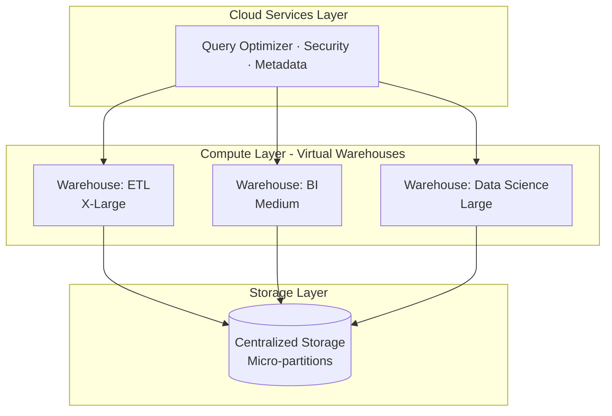

# 🎯 MISSION 11 — Snowflake Migration Project

```
┌────────────────────────────────────────────────────────────────────┐
│  LEVEL 6: Snowflake Developer                                      │
│  XP AVAILABLE: 1000                                              │
│  CONCEPTS: Virtual Warehouses · Streams · Tasks · Dynamic Tables │
│            · Clustering · Micro-partitions · Time Travel          │
│            · Zero-Copy Cloning                                    │
│  ESTIMATED TIME: 90 minutes                                       │
└────────────────────────────────────────────────────────────────────┘
```

---

## 📧 The Migration

> **From:** Marcus Thompson (CTO)
> **To:** You (Snowflake Developer)
> **Subject:** Cloud migration approved — Postgres → Snowflake
>
> *"The board approved our cloud data warehouse migration. We're moving from PostgreSQL to Snowflake.*
>
> *Good news: your SQL skills transfer almost completely. But Snowflake has powerful features Postgres doesn't — Time Travel, Zero-Copy Cloning, automatic micro-partitioning, Streams and Tasks for pipelines.*
>
> *I need you to understand how our PostgreSQL concepts map to Snowflake, and learn the cloud-native features that make Snowflake special.*
>
> *— Marcus"*

---

## 🧭 Why This Matters (The Real World)

Snowflake is the dominant cloud data warehouse. Snowflake skills command premium salaries ($150K–$220K+).

The great news: **Snowflake uses ANSI SQL**, so everything you've learned (SELECT, JOIN, window functions, CTEs) works almost identically. This mission focuses on what's *different* and *better*.

| Role | How they use Snowflake |
|------|------------------------|
| **Snowflake Developer** | Builds cloud DW pipelines |
| **Analytics Engineer** | Runs dbt on Snowflake |
| **Data Engineer** | Streams + Tasks for ELT |
| **Architect** | Designs multi-cluster compute strategies |

> ⚠️ **Note:** This mission teaches Snowflake *concepts and syntax*. To run these you'd need a Snowflake account (free trial at signup.snowflake.com). The PostgreSQL knowledge you've built is the foundation.

---

## 📚 Concept 1 — Snowflake Architecture

Snowflake separates **storage** from **compute** — the key innovation.



- **Storage** — one copy of data, stored in compressed **micro-partitions**.
- **Compute** — independent **virtual warehouses** that read the same storage.
- Multiple teams query the same data without competing for resources.

### Virtual Warehouses

```sql
-- Create a virtual warehouse (compute cluster)
CREATE WAREHOUSE etl_wh
    WAREHOUSE_SIZE = 'LARGE'
    AUTO_SUSPEND = 60          -- suspend after 60s idle (save money)
    AUTO_RESUME = TRUE
    INITIALLY_SUSPENDED = TRUE;

-- Scale up for a heavy job, down for light work
ALTER WAREHOUSE etl_wh SET WAREHOUSE_SIZE = 'XLARGE';

-- Use it
USE WAREHOUSE etl_wh;
```

> 💡 You pay only for compute time while a warehouse runs. `AUTO_SUSPEND` is how you control cost.

---

## 📚 Concept 2 — Micro-partitions & Clustering

Snowflake automatically divides tables into **micro-partitions** (~16MB compressed chunks) and tracks metadata (min/max values) for each. This enables automatic **partition pruning** — no manual partitioning like in PostgreSQL.

```sql
-- For very large tables, define a clustering key to co-locate related data
ALTER TABLE fact_sales CLUSTER BY (sale_date, customer_key);

-- Check clustering health
SELECT SYSTEM$CLUSTERING_INFORMATION('fact_sales', '(sale_date, customer_key)');
```

| PostgreSQL | Snowflake |
|------------|-----------|
| Manual `CREATE INDEX` | Automatic micro-partitions |
| Manual `PARTITION BY` | Automatic + optional clustering key |
| `VACUUM` / `ANALYZE` | Fully automatic |

---

## 📚 Concept 3 — Time Travel

Query data **as it was** in the past — undo mistakes, audit changes, recover dropped tables.

```sql
-- Query the table as it was 1 hour ago
SELECT * FROM fact_sales
AT (OFFSET => -3600);   -- seconds ago

-- Query as of a specific timestamp
SELECT * FROM fact_sales
AT (TIMESTAMP => '2024-11-01 09:00:00'::TIMESTAMP);

-- Oops — accidentally deleted rows. Recover them:
INSERT INTO fact_sales
SELECT * FROM fact_sales BEFORE (STATEMENT => '<query_id>');

-- Restore an accidentally dropped table
UNDROP TABLE fact_sales;
```

Default retention is 1 day (up to 90 days on Enterprise). This feature alone saves countless production disasters. PostgreSQL has nothing equivalent built in.

---

## 📚 Concept 4 — Zero-Copy Cloning

Instantly clone a table, schema, or entire database **without copying data** (it shares storage until changes are made).

```sql
-- Instantly clone production to a dev environment — no extra storage cost
CREATE TABLE fact_sales_dev CLONE fact_sales;

-- Clone an entire database for testing
CREATE DATABASE analytics_test CLONE analytics_prod;
```

This lets teams spin up full test environments in seconds. Revolutionary for CI/CD and experimentation.

---

## 📚 Concept 5 — Streams (Change Data Capture)

A **Stream** tracks changes (inserts/updates/deletes) to a table — Snowflake's built-in CDC.

```sql
-- Create a stream on the source table
CREATE STREAM sales_stream ON TABLE raw_sales;

-- The stream now captures every change. Consume it:
SELECT * FROM sales_stream;
-- Shows changed rows + METADATA$ACTION (INSERT/DELETE), METADATA$ISUPDATE

-- Typical pattern: process only new/changed rows into a target
INSERT INTO fact_sales
SELECT ... FROM sales_stream WHERE METADATA$ACTION = 'INSERT';
```

Streams power incremental ELT — process only what changed, not the whole table.

---

## 📚 Concept 6 — Tasks (Scheduled Automation)

A **Task** runs SQL on a schedule or when a stream has data — Snowflake's built-in scheduler (like a lightweight Airflow).

```sql
-- Run every hour to process the stream
CREATE TASK process_sales_task
    WAREHOUSE = etl_wh
    SCHEDULE = '60 MINUTE'
    WHEN SYSTEM$STREAM_HAS_DATA('sales_stream')
AS
    INSERT INTO fact_sales
    SELECT ... FROM sales_stream WHERE METADATA$ACTION = 'INSERT';

-- Tasks can chain into DAGs
CREATE TASK downstream_task
    WAREHOUSE = etl_wh
    AFTER process_sales_task
AS
    CALL refresh_aggregates();

-- Activate
ALTER TASK process_sales_task RESUME;
```

---

## 📚 Concept 7 — Dynamic Tables

**Dynamic Tables** automatically keep a query's results up to date — declarative pipelines (replaces manual Streams+Tasks for many cases).

```sql
CREATE DYNAMIC TABLE daily_revenue
    TARGET_LAG = '1 hour'      -- keep within 1 hour of fresh
    WAREHOUSE = etl_wh
AS
    SELECT 
        sale_date,
        SUM(revenue) AS total_revenue
    FROM fact_sales
    GROUP BY sale_date;
```

Snowflake automatically refreshes it as source data changes. This is the modern, declarative way to build pipelines.

---

## 🔄 PostgreSQL → Snowflake Cheat Sheet

| PostgreSQL | Snowflake | Notes |
|------------|-----------|-------|
| `SERIAL` | `AUTOINCREMENT` / `IDENTITY` | Auto-increment |
| `TEXT` | `VARCHAR` / `STRING` | Snowflake has no length penalty |
| `BOOLEAN` | `BOOLEAN` | Same |
| `NOW()` | `CURRENT_TIMESTAMP()` | Same idea |
| `CREATE INDEX` | *(none needed)* | Auto micro-partitions |
| `PARTITION BY` (table) | `CLUSTER BY` | Optional clustering |
| `ILIKE` | `ILIKE` | Both support it! |
| `generate_series` | `GENERATOR` / `SEQ4()` | Row generation |
| Materialized View | Materialized View / Dynamic Table | Snowflake auto-refreshes |
| `VACUUM` | *(automatic)* | No maintenance needed |
| `jsonb` | `VARIANT` | Semi-structured data |
| Window functions | Window functions | Identical |
| CTEs | CTEs | Identical |

> 💡 **The big takeaway:** 90% of your SQL transfers unchanged. The differences are in DDL, performance management (automatic in Snowflake), and the cloud-native features (Time Travel, Cloning, Streams/Tasks).

---

## 🏋️ Exercises (Conceptual + Snowflake Trial)

1. Write the Snowflake DDL equivalent of the PostgreSQL `fact_sales` table from Mission 10.
2. Create a virtual warehouse sized `SMALL` with `AUTO_SUSPEND = 120`.
3. Write a Time Travel query to see a table's state 30 minutes ago.
4. Write a Zero-Copy Clone command to create a dev copy of `dim_customer`.
5. Create a Stream on `dim_customer` and describe what it captures.
6. Create a Task that refreshes a summary table every 30 minutes.
7. Convert a PostgreSQL materialized view into a Snowflake Dynamic Table.
8. Map these PostgreSQL types to Snowflake: `SERIAL`, `TEXT`, `jsonb`, `TIMESTAMP`.

→ Solutions: [SOLUTIONS/MISSION-11.md](../../SOLUTIONS/MISSION-11.md)

---

## 🧪 Quiz

→ [QUIZZES/MISSION-11-quiz.md](../../QUIZZES/MISSION-11-quiz.md)

---

## 🔥 Challenge (Bonus 200 XP)

> Marcus asks: *"Design the Snowflake migration architecture for our star schema. Show: (1) the warehouse strategy (which warehouses for which workloads), (2) how you'd use Streams + Tasks for incremental loading, (3) how Time Travel and Cloning fit into your dev/test/prod strategy. Write the key DDL."*

See [DIAGRAMS/snowflake-architecture.md](../../DIAGRAMS/snowflake-architecture.md).

---

## 🎓 What You Learned

```
✓ Snowflake architecture: storage/compute separation
✓ Virtual Warehouses + auto-suspend cost control
✓ Micro-partitions and clustering keys
✓ Time Travel — query/recover historical data
✓ Zero-Copy Cloning — instant environments
✓ Streams — built-in change data capture
✓ Tasks — scheduled SQL automation + DAGs
✓ Dynamic Tables — declarative pipelines
✓ PostgreSQL → Snowflake syntax mapping
```

**XP EARNED: 1000** (+200 bonus for the challenge)

---

## ➡️ Next Mission

Now build the pipelines that feed the warehouse — data engineering at scale...

→ [MISSION 12 — Data Engineering Pipelines](../MISSION-12/README.md)
