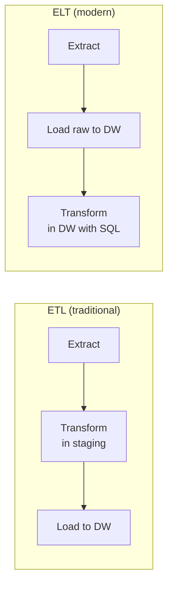

# 🎯 MISSION 12 — Data Engineering Pipelines

```
┌────────────────────────────────────────────────────────────────────┐
│  LEVEL 4-5: Data Engineer / Senior Data Engineer                   │
│  XP AVAILABLE: 900                                               │
│  CONCEPTS: ETL · ELT · CDC · Data Quality · Pipelines            │
│            · Batch · Streaming · Airflow · PySpark               │
│  ESTIMATED TIME: 85 minutes                                       │
└────────────────────────────────────────────────────────────────────┘
```

---

## 📧 The Modernization

> **From:** Nicholas Richardson (Head of Data Engineering)
> **To:** You (Data Engineer)
> **Subject:** Modernize our data pipelines
>
> *"Our data pipelines are a mess of cron jobs and manual scripts. We need a proper architecture.*
>
> *I need you to understand ETL vs ELT, build data quality checks in SQL, handle change data capture so we only process what changed, and understand how SQL fits into Airflow and Spark.*
>
> *SQL is the heart of every pipeline. Let's build it right.*
>
> *— Nicholas"*

---

## 🧭 Why This Matters (The Real World)

Data engineering is about **moving and transforming data reliably at scale**. SQL is the core language of every pipeline — whether it runs in Airflow, dbt, Spark, or Snowflake.

| Role | How they build pipelines |
|------|--------------------------|
| **Data Engineer** | ETL/ELT, orchestration, CDC |
| **Analytics Engineer** | Transformation layer (dbt) |
| **Platform Engineer** | Streaming + batch infrastructure |
| **Architect** | End-to-end data flow design |

---

## 📚 Concept 1 — ETL vs ELT



- **ETL** (Extract → Transform → Load): transform data *before* loading. Traditional, used when compute was expensive.
- **ELT** (Extract → Load → Transform): load raw data first, transform *inside* the warehouse using SQL. Modern, leverages cheap cloud compute (Snowflake/BigQuery).

| | ETL | ELT |
|--|-----|-----|
| Transform location | Separate engine | In the warehouse |
| Speed to load | Slower | Faster (load raw) |
| Flexibility | Fixed schema upfront | Transform anytime |
| Modern stack | Legacy | dbt + Snowflake |

> 💡 The modern data stack is **ELT**: load raw with a tool like Fivetran/Airbyte, then transform with **dbt** (which is just organized SQL).

---

## 📚 Concept 2 — Building an ELT Transformation in SQL

The medallion architecture: **Bronze (raw) → Silver (cleaned) → Gold (business-ready)**.

```sql
-- BRONZE: raw landing table (load as-is, no transformation)
CREATE TABLE bronze_orders AS
SELECT * FROM orders;   -- in reality, loaded from source

-- SILVER: cleaned & standardized
CREATE TABLE silver_orders AS
SELECT 
    order_id,
    customer_id,
    sales_rep_id,
    order_date,
    UPPER(TRIM(order_status))      AS order_status,   -- standardize
    COALESCE(discount_pct, 0)      AS discount_pct,   -- handle NULLs
    shipped_date
FROM bronze_orders
WHERE order_date IS NOT NULL        -- drop bad rows
  AND customer_id IS NOT NULL;

-- GOLD: business-ready aggregated metrics
CREATE TABLE gold_daily_revenue AS
SELECT 
    o.order_date,
    COUNT(DISTINCT o.order_id) AS orders,
    SUM(oi.line_total)         AS revenue
FROM silver_orders o
JOIN order_items oi ON o.order_id = oi.order_id
WHERE o.order_status = 'DELIVERED'
GROUP BY o.order_date;
```

Each layer is a SQL transformation. This is exactly how dbt models work.

---

## 📚 Concept 3 — Change Data Capture (CDC)

Instead of reprocessing entire tables, process only what **changed**. Essential for efficiency at scale.

### Pattern 1 — Timestamp-Based (Incremental)

```sql
-- Process only rows modified since the last run
SELECT *
FROM source_orders
WHERE updated_at > (SELECT MAX(last_loaded_at) FROM etl_watermark);
```

### Pattern 2 — MERGE (Upsert)

`MERGE` inserts new rows and updates existing ones in one statement — the workhorse of incremental loads.

```sql
MERGE INTO dim_customer AS target
USING staging_customer AS source
ON target.customer_id = source.customer_id
WHEN MATCHED THEN
    UPDATE SET 
        company_name = source.company_name,
        contract_tier = source.contract_tier
WHEN NOT MATCHED THEN
    INSERT (customer_id, company_name, contract_tier)
    VALUES (source.customer_id, source.company_name, source.contract_tier);
```

> 💡 PostgreSQL 15+ supports `MERGE`. Earlier versions use `INSERT ... ON CONFLICT ... DO UPDATE` (upsert).

```sql
-- PostgreSQL upsert alternative
INSERT INTO dim_customer (customer_id, company_name, contract_tier)
VALUES (13, 'FinTech Ventures', 'Business')
ON CONFLICT (customer_id)
DO UPDATE SET 
    company_name = EXCLUDED.company_name,
    contract_tier = EXCLUDED.contract_tier;
```

---

## 📚 Concept 4 — Data Quality Checks in SQL

Bad data breaks dashboards and AI models. Build quality gates into every pipeline.

```sql
-- Test 1: No NULLs in critical columns
SELECT COUNT(*) AS null_customer_ids
FROM orders WHERE customer_id IS NULL;
-- Expectation: 0

-- Test 2: No duplicate primary keys
SELECT customer_id, COUNT(*)
FROM customers
GROUP BY customer_id
HAVING COUNT(*) > 1;
-- Expectation: no rows

-- Test 3: Referential integrity (orphaned foreign keys)
SELECT o.order_id
FROM orders o
LEFT JOIN customers c ON o.customer_id = c.customer_id
WHERE c.customer_id IS NULL;
-- Expectation: no rows

-- Test 4: Values in valid range
SELECT * FROM employees
WHERE salary < 0 OR salary > 1000000;
-- Expectation: no rows

-- Test 5: Accepted values only
SELECT DISTINCT order_status FROM orders
WHERE order_status NOT IN ('Pending','Processing','Shipped','Delivered','Cancelled','Returned');
-- Expectation: no rows
```

These map directly to **dbt tests** (`not_null`, `unique`, `relationships`, `accepted_values`) and **Great Expectations** checks.

```sql
-- A reusable data quality summary
SELECT 
    'orders' AS table_name,
    COUNT(*) AS total_rows,
    COUNT(*) FILTER (WHERE customer_id IS NULL) AS null_customers,
    COUNT(*) FILTER (WHERE order_date IS NULL)  AS null_dates,
    COUNT(DISTINCT order_id) AS unique_ids,
    COUNT(*) - COUNT(DISTINCT order_id) AS duplicate_ids
FROM orders;
```

---

## 📚 Concept 5 — Orchestration (Airflow Concepts)

**Apache Airflow** schedules and monitors pipelines as DAGs (Directed Acyclic Graphs). SQL is what each task usually runs.

```python
# Conceptual Airflow DAG (Python) — each task runs SQL
from airflow import DAG
from airflow.providers.postgres.operators.postgres import PostgresOperator

with DAG('daily_revenue_pipeline', schedule='@daily') as dag:

    load_silver = PostgresOperator(
        task_id='load_silver',
        sql='sql/silver_orders.sql'
    )

    quality_check = PostgresOperator(
        task_id='quality_check',
        sql='sql/quality_checks.sql'
    )

    build_gold = PostgresOperator(
        task_id='build_gold',
        sql='sql/gold_daily_revenue.sql'
    )

    # Define order: load → check → build
    load_silver >> quality_check >> build_gold
```

The Python defines *orchestration*; the **SQL files do the actual work**. Your SQL skills are the substance of every task.

---

## 📚 Concept 6 — Batch vs Streaming

| | Batch | Streaming |
|--|-------|-----------|
| Processing | Scheduled chunks (hourly/daily) | Continuous, real-time |
| Latency | Minutes to hours | Seconds or less |
| Tools | Airflow, dbt, Spark | Kafka, Flink, Spark Streaming |
| Example | Nightly revenue report | Live fraud detection |
| SQL role | Transformations | Stream SQL (KSQL, Flink SQL) |

```sql
-- Conceptual Streaming SQL (Flink/KSQL style) — windowed aggregation
SELECT 
    customer_id,
    COUNT(*) AS orders_last_hour,
    SUM(amount) AS revenue_last_hour
FROM orders_stream
GROUP BY 
    customer_id,
    TUMBLE(event_time, INTERVAL '1' HOUR);   -- 1-hour tumbling window
```

---

## 📚 Concept 7 — PySpark + SQL

**Spark** processes massive datasets in parallel. You can use SQL directly via Spark SQL.

```python
# PySpark — SQL on big data
df = spark.read.parquet("s3://data/orders/")
df.createOrReplaceTempView("orders")

result = spark.sql("""
    SELECT customer_id, SUM(amount) AS total
    FROM orders
    GROUP BY customer_id
    HAVING SUM(amount) > 100000
""")

result.write.mode("overwrite").parquet("s3://data/high_value_customers/")
```

Same SQL you've learned — running across a distributed cluster on terabytes.

---

## 🏋️ Exercises

1. Build a Silver-layer transformation of `customers`: standardize country codes, handle NULL `nps_score`, drop rows missing `company_name`.
2. Write a `MERGE` (or `INSERT ... ON CONFLICT`) to upsert into `dim_product`.
3. Write 5 data quality checks for the `orders` table (nulls, duplicates, referential integrity, valid ranges, accepted values).
4. Build a Gold-layer table: monthly revenue and order count per customer industry.
5. Write an incremental extraction query using a watermark (`updated_at > last_run`).
6. Write the SQL that an Airflow task would run to refresh `gold_daily_revenue`.
7. Write a data quality summary query that returns row counts, null counts, and duplicate counts for `employees` in one result.
8. Explain (in comments) when you'd choose batch vs streaming for: payroll, fraud detection, daily KPIs, live dashboards.

→ Solutions: [SOLUTIONS/MISSION-12.md](../../SOLUTIONS/MISSION-12.md)

---

## 🧪 Quiz

→ [QUIZZES/MISSION-12-quiz.md](../../QUIZZES/MISSION-12-quiz.md)

---

## 🔥 Challenge (Bonus 150 XP)

> Nicholas asks: *"Design a complete Bronze→Silver→Gold ELT pipeline for DataVerse sales. Include: raw landing, cleaning transformations, a MERGE-based incremental load, 5 data quality tests, and the final Gold business table. Document the Airflow DAG order."*

See [DIAGRAMS/etl-flow.md](../../DIAGRAMS/etl-flow.md) and [DIAGRAMS/elt-flow.md](../../DIAGRAMS/elt-flow.md).

---

## 🎓 What You Learned

```
✓ ETL vs ELT — and why modern stacks use ELT
✓ Medallion architecture: Bronze → Silver → Gold
✓ Change Data Capture (timestamp + MERGE)
✓ MERGE / INSERT ON CONFLICT (upserts)
✓ Data quality checks in SQL (5 types)
✓ Airflow orchestration concepts
✓ Batch vs Streaming tradeoffs
✓ Streaming SQL with windows
✓ PySpark + Spark SQL
```

**XP EARNED: 900** (+150 bonus for the challenge)

---

## ➡️ Next Mission

The pipelines feed the warehouse. Now build the analytics that drive decisions...

→ [MISSION 13 — Analytics Use Cases](../MISSION-13/README.md)
