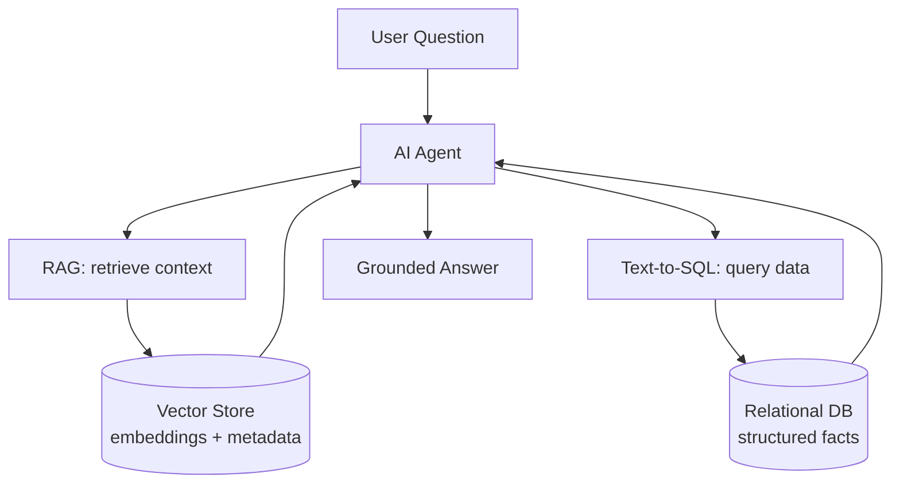
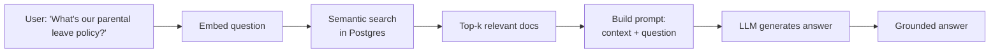
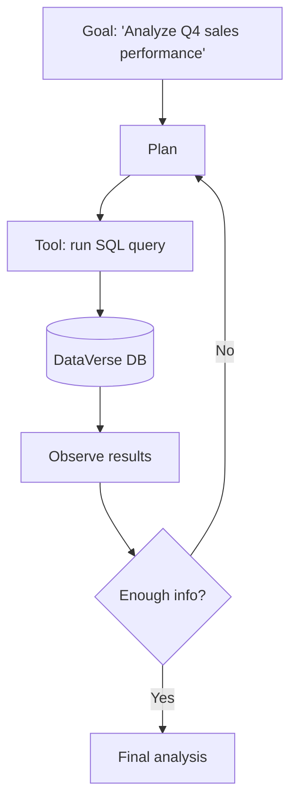
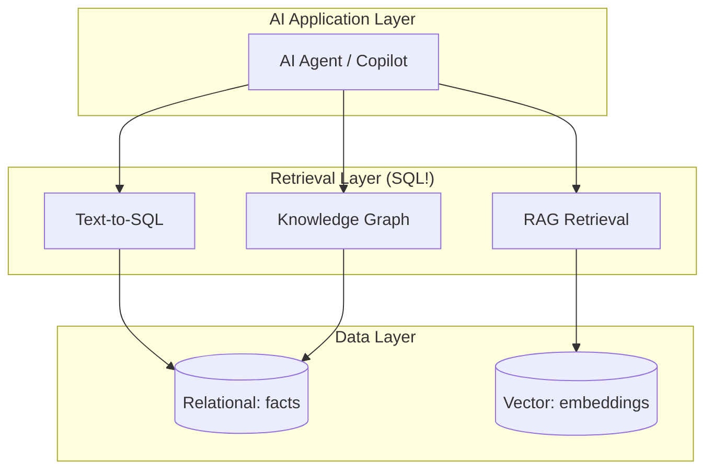

# 🎯 MISSION 14 — SQL for AI

```
┌────────────────────────────────────────────────────────────────────┐
│  LEVEL 8: AI & Agentic Systems Builder                             │
│  XP AVAILABLE: 1100                                             │
│  CONCEPTS: Vector Metadata · Embeddings · RAG · Semantic Search  │
│            · Knowledge Graphs · Text-to-SQL · AI Agents          │
│            · Agentic Systems                                      │
│  ESTIMATED TIME: 100 minutes                                      │
└────────────────────────────────────────────────────────────────────┘
```

---

## 📧 The Final Mission

> **From:** Angela Davis (Chief Data Officer)
> **To:** You (AI & Agentic Systems Builder)
> **Subject:** Build DataVerse's AI brain
>
> *"You've come further than anyone. From your first SELECT to designing data warehouses and Snowflake pipelines. Now the final frontier.*
>
> *Every AI system — ChatGPT, Claude, our internal copilots — is powered by structured data. RAG retrieves it. Agents query it. Text-to-SQL generates it. Vector databases store embeddings alongside metadata in SQL.*
>
> *I need you to understand how SQL is the foundation of modern AI. Build the data layer that our AI agents will think with.*
>
> *This is the summit. Make it count.*
>
> *— Angela"*

---

## 🧭 Why This Matters (The Real World)

The biggest misconception in AI is that it's "just models." In reality, **AI runs on data infrastructure** — and SQL is at the center. RAG systems, AI agents, and Text-to-SQL all depend on well-structured databases.

| Role | How they use SQL + AI |
|------|----------------------|
| **AI Engineer** | RAG pipelines, embedding stores |
| **ML Engineer** | Feature stores, training data |
| **Agentic Systems Builder** | Agents that query databases |
| **Data Architect** | Vector + relational architecture |

---

## 📚 Concept 1 — How AI Depends on Structured Data



- **LLMs don't know your data** — they're trained on public text.
- To answer questions about *your* business, AI must **retrieve** facts from your databases.
- That retrieval is powered by SQL (relational) + vector search (embeddings).

---

## 📚 Concept 2 — Embeddings & Vector Metadata

An **embedding** is a list of numbers (a vector) representing the meaning of text. Similar meanings → nearby vectors. We store embeddings *alongside* relational metadata.

PostgreSQL handles this with the **pgvector** extension:

```sql
-- Enable vector support
CREATE EXTENSION IF NOT EXISTS vector;

-- A table storing documents + their embeddings + metadata
CREATE TABLE document_embeddings (
    doc_id        SERIAL PRIMARY KEY,
    content       TEXT NOT NULL,
    source_table  VARCHAR(50),        -- metadata: where it came from
    source_id     INTEGER,            -- metadata: link to relational row
    category      VARCHAR(50),
    embedding     vector(1536),       -- the embedding (OpenAI dimension)
    created_at    TIMESTAMP DEFAULT NOW()
);

-- Index for fast similarity search
CREATE INDEX ON document_embeddings 
USING ivfflat (embedding vector_cosine_ops);
```

The **metadata columns** (`source_table`, `category`) are pure SQL — they let you filter *before* or *after* vector search.

---

## 📚 Concept 3 — Semantic Search

Find documents by *meaning*, not keywords, using vector distance operators.

```sql
-- Find the 5 most semantically similar documents to a query embedding
-- (<=> is cosine distance in pgvector)
SELECT 
    doc_id,
    content,
    category,
    1 - (embedding <=> '[0.12, 0.45, ...]'::vector) AS similarity_score
FROM document_embeddings
ORDER BY embedding <=> '[0.12, 0.45, ...]'::vector   -- nearest first
LIMIT 5;

-- Hybrid search: combine semantic + metadata filter (the SQL advantage)
SELECT doc_id, content, similarity_score FROM (
    SELECT 
        doc_id, content,
        1 - (embedding <=> :query_vec) AS similarity_score
    FROM document_embeddings
    WHERE category = 'HR Policy'        -- metadata filter narrows the search
) ranked
WHERE similarity_score > 0.75
ORDER BY similarity_score DESC
LIMIT 5;
```

> 💡 This **hybrid search** (vector + SQL filter) is where relational skills shine. Pure vector DBs struggle with rich filtering — Postgres + pgvector does both.

---

## 📚 Concept 4 — RAG (Retrieval-Augmented Generation)

RAG = retrieve relevant data, then give it to the LLM as context so it answers accurately about *your* data.



The **retrieval step is SQL**:

```sql
-- RAG retrieval: get the context chunks to feed the LLM
SELECT content
FROM document_embeddings
WHERE source_table = 'hr_policies'
ORDER BY embedding <=> :question_embedding
LIMIT 4;
-- These 4 chunks become the LLM's context. The model answers ONLY from them.
```

This is why RAG reduces hallucination — the model is grounded in real retrieved rows.

---

## 📚 Concept 5 — Text-to-SQL

The AI translates a natural-language question into SQL, runs it, and returns the answer. This is how "chat with your data" works.

```
User: "How many active employees are in the Sales department?"

    ↓ LLM uses the schema to generate:

SELECT COUNT(*)
FROM employees e
JOIN departments d ON e.department_id = d.department_id
WHERE d.department_name = 'Sales'
  AND e.status = 'Active';

    ↓ Execute → return result → LLM phrases the answer:

"There are 12 active employees in the Sales department."
```

To enable reliable Text-to-SQL, you give the LLM a **schema description** (the data dictionary):

```sql
-- Generate a machine-readable schema description for the LLM
SELECT 
    table_name,
    column_name,
    data_type
FROM information_schema.columns
WHERE table_schema = 'public'
ORDER BY table_name, ordinal_position;
```

> ⚠️ **Security:** Always run AI-generated SQL with a **read-only role** and validate it. Never let an LLM execute arbitrary writes. This is a critical guardrail.

```sql
-- Create a safe read-only role for AI agents
CREATE ROLE ai_agent_readonly;
GRANT CONNECT ON DATABASE dataverse TO ai_agent_readonly;
GRANT USAGE ON SCHEMA public TO ai_agent_readonly;
GRANT SELECT ON ALL TABLES IN SCHEMA public TO ai_agent_readonly;
-- No INSERT/UPDATE/DELETE — the agent can only read.
```

---

## 📚 Concept 6 — Knowledge Graphs in SQL

A knowledge graph stores **entities** and **relationships**. SQL models this with nodes and edges tables — and recursive CTEs traverse it.

```sql
-- Nodes (entities) and edges (relationships)
CREATE TABLE kg_nodes (
    node_id   SERIAL PRIMARY KEY,
    node_type VARCHAR(50),   -- 'Employee', 'Department', 'Project'
    name      VARCHAR(200)
);

CREATE TABLE kg_edges (
    edge_id      SERIAL PRIMARY KEY,
    from_node    INTEGER REFERENCES kg_nodes(node_id),
    to_node      INTEGER REFERENCES kg_nodes(node_id),
    relationship VARCHAR(50)   -- 'MANAGES', 'WORKS_IN', 'OWNS'
);

-- Traverse the org graph: who does the CEO manage, directly & indirectly?
WITH RECURSIVE org_graph AS (
    SELECT from_node, to_node, 1 AS depth
    FROM kg_edges WHERE from_node = 1 AND relationship = 'MANAGES'
    UNION ALL
    SELECT e.from_node, e.to_node, og.depth + 1
    FROM kg_edges e
    JOIN org_graph og ON e.from_node = og.to_node
    WHERE e.relationship = 'MANAGES'
)
SELECT n.name, og.depth
FROM org_graph og
JOIN kg_nodes n ON og.to_node = n.node_id
ORDER BY depth;
```

Recursive CTEs (Mission 6) are the engine of graph traversal — knowledge graphs power advanced AI reasoning.

---

## 📚 Concept 7 — AI Agents Querying Databases

An **AI agent** uses tools in a loop: think → act (query DB) → observe → repeat, until it answers.



The agent's **tools are SQL queries**:

```python
# Conceptual agent tool definition
def query_database(sql: str) -> list:
    """Tool the AI agent calls to read DataVerse data (read-only role)."""
    return execute_readonly(sql)

# The agent decides which SQL to run to achieve its goal:
#   1. SELECT SUM(revenue) ... WHERE quarter = 4
#   2. SELECT rep, SUM(revenue) ... GROUP BY rep ORDER BY ... LIMIT 5
#   3. Compare to Q3 ... and synthesizes a narrative
```

Every "thought" the agent has about your business becomes a SQL query. **SQL is the agent's sense of reality.**

---

## 📚 Concept 8 — The Full Picture



You now understand the entire stack — from raw SQL to AI's data foundation. **You are a Data Architect and AI Professional.**

---

## 🏋️ Exercises

1. Write the DDL for a `document_embeddings` table with content, metadata, and a `vector(1536)` column.
2. Write a semantic search query returning the top 5 most similar documents to a query vector.
3. Write a hybrid search combining a metadata filter (`category`) with vector similarity.
4. Write the RAG retrieval query that fetches the top 4 context chunks for an HR question.
5. Write the Text-to-SQL output for: "What is total revenue by product category in 2024?"
6. Create a read-only `ai_agent_readonly` role with SELECT-only grants.
7. Model an org knowledge graph (`kg_nodes`, `kg_edges`) and write a recursive query to find everyone under the VP of Sales.
8. Describe (in SQL comments) the 3 queries an AI agent would run to "analyze top customers at churn risk."

→ Solutions: [SOLUTIONS/MISSION-14.md](../../SOLUTIONS/MISSION-14.md)

---

## 🧪 Quiz

→ [QUIZZES/MISSION-14-quiz.md](../../QUIZZES/MISSION-14-quiz.md)

---

## 🔥 Challenge (Bonus 300 XP) — The Capstone

> Angela's final ask: *"Build DataVerse's AI Data Layer blueprint: (1) a pgvector embeddings table linked to our relational tables, (2) a semantic + hybrid search query, (3) a RAG retrieval flow, (4) a secure read-only role for agents, (5) a Text-to-SQL schema export, (6) a knowledge graph of our org. Document how an AI agent would use all of it to answer 'Which departments are at highest attrition risk and why?'"*

See [DIAGRAMS/agentic-ai-architecture.md](../../DIAGRAMS/agentic-ai-architecture.md) and [DIAGRAMS/rag-architecture.md](../../DIAGRAMS/rag-architecture.md).

---

## 🎓 What You Learned

```
✓ How AI depends on structured data
✓ Embeddings & vector metadata (pgvector)
✓ Semantic search + hybrid search
✓ RAG retrieval pipelines in SQL
✓ Text-to-SQL + schema export for LLMs
✓ Read-only security guardrails for AI agents
✓ Knowledge graphs with recursive CTEs
✓ AI agents querying databases as tools
✓ The complete SQL → AI architecture
```

**XP EARNED: 1100** (+300 bonus for the capstone)

---

## 🏆 You Did It

You started before Snowflake, before data engineering, before analytics, before AI — with a single `SELECT`. Now you understand the entire data universe and how AI thinks with it.

**You are a Data Architect & AI Professional.** 🎓

→ Build your portfolio: [PROJECTS/](../../PROJECTS/) · Prep for interviews: [INTERVIEW_PREP/](../../INTERVIEW_PREP/)
