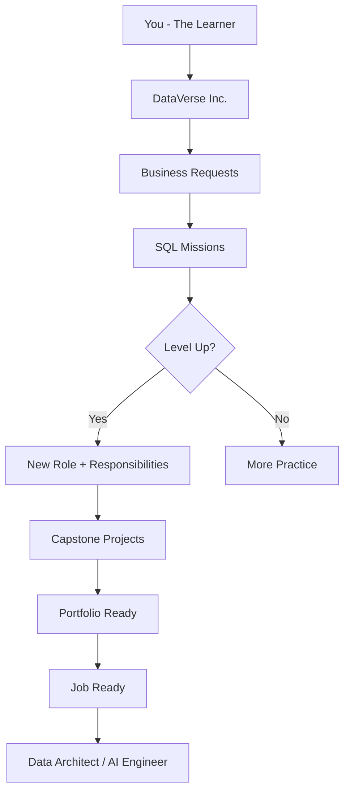
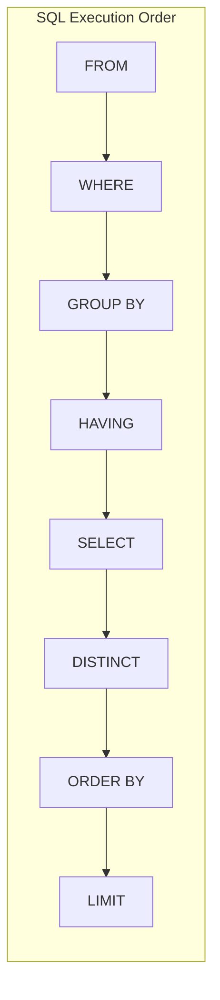

# 🗄️ master-data-ai-sql

<div align="center">

```
╔══════════════════════════════════════════════════════════════════════╗
║                                                                      ║
║        MASTER  DATA  &  AI  —  SQL  ENGINEERING  PROGRAM            ║
║                                                                      ║
║   Before Snowflake.  Before Data Engineering.  Before Analytics.    ║
║        Before AI.        There is SQL.                              ║
║                                                                      ║
╚══════════════════════════════════════════════════════════════════════╝
```

[](https://postgresql.org)
[](LICENSE)
[](https://github.com/yourusername/master-data-ai-sql/stargazers)
[](MISSIONS/)
[](PROJECTS/)
[](#career-journey)

</div>

---

## 🎯 This Is Not a Tutorial. This Is a Career Transformation.

Most SQL courses teach you syntax.

**This program transforms you into a Data Professional.**

You will join **DataVerse Inc.** — a fictional company with real business problems. The CEO, HR Director, Sales Director, Finance Manager, Marketing Manager, and Chief Data Officer will send you tasks. You will solve them using SQL.

By the time you finish, you will not just know SQL.

You will think like a **Data Architect**.

---

## 🗺️ The Career Journey

```
┌─────────────────────────────────────────────────────────────────────┐
│                    YOUR CAREER PROGRESSION                          │
├──────────┬──────────────────────────────────┬───────────┬──────────┤
│  LEVEL   │  ROLE                            │  MISSIONS │  XP      │
├──────────┼──────────────────────────────────┼───────────┼──────────┤
│  Lv. 1   │  Junior Data Analyst             │  1 – 2    │  0-500   │
│  Lv. 2   │  Reporting Analyst               │  3 – 4    │  500-1.5K│
│  Lv. 3   │  Analytics Engineer              │  5 – 6    │  1.5-3K  │
│  Lv. 4   │  Data Engineer                   │  7 – 8    │  3-4.5K  │
│  Lv. 5   │  Senior Data Engineer            │  9        │  4.5-6K  │
│  Lv. 6   │  Snowflake Developer             │  10 – 11  │  6-7.5K  │
│  Lv. 7   │  Data Architect                  │  12 – 13  │  7.5-9K  │
│  Lv. 8   │  AI & Agentic Systems Builder    │  14       │  9-10K   │
└──────────┴──────────────────────────────────┴───────────┴──────────┘
```

---

## 📦 What's Inside

| Folder | Contents |
|--------|----------|
| 📂 [SETUP/](SETUP/) | PostgreSQL, pgAdmin, DBeaver, Docker setup guides |
| 📂 [DATASETS/](DATASETS/) | 12+ realistic business datasets with DDL + data |
| 📂 [MISSIONS/](MISSIONS/) | 14 story-driven SQL missions with exercises |
| 📂 [PROJECTS/](PROJECTS/) | 8 capstone projects (HR, Sales, Finance, AI) |
| 📂 [CHEATSHEETS/](CHEATSHEETS/) | 9 professional PDF-ready cheat sheets |
| 📂 [INTERVIEW_PREP/](INTERVIEW_PREP/) | 300 SQL interview Q&A with explanations |
| 📂 [QUIZZES/](QUIZZES/) | Knowledge check quizzes per mission |
| 📂 [SOLUTIONS/](SOLUTIONS/) | Fully worked SQL solutions |
| 📂 [DIAGRAMS/](DIAGRAMS/) | Architecture & concept visual diagrams |
| 📂 [BLOGS/](BLOGS/) | 20 technical blog posts (publish-ready) |
| 📂 [LINKEDIN_POSTS/](LINKEDIN_POSTS/) | 20 engagement-optimized LinkedIn posts |
| 📂 [NEWSLETTER_CONTENT/](NEWSLETTER_CONTENT/) | Newsletter templates |

---

## 🚀 Start Here

**New to SQL?** → [START-HERE.md](START-HERE.md)

**Want a plan?**
- [30-DAY-PLAN.md](30-DAY-PLAN.md) — SQL Foundations
- [60-DAY-PLAN.md](60-DAY-PLAN.md) — Analytics Engineering
- [90-DAY-PLAN.md](90-DAY-PLAN.md) — Data Architect + AI

**Need to install PostgreSQL?** → [SETUP/](SETUP/)

---

## 🏢 The DataVerse Inc. Story

You just received an email:

> *"Welcome to DataVerse Inc. Your title is Junior Data Analyst.  
> The CEO has requested your first report by end of day.  
> Your manager says: 'Don't worry — just open the database and start querying.'  
> Good luck."*

Every mission is a real business request.  
Every concept is justified by a business need.  
Every skill you learn makes you more valuable.

---

## 🧩 The 14 Missions

| # | Mission | Business Request | SQL Concepts | XP |
|---|---------|-----------------|--------------|-----|
| 01 | [CEO Wants Workforce Insights](MISSIONS/MISSION-01/) | Board meeting tomorrow | SELECT, FROM, LIMIT, DISTINCT | 200 |
| 02 | [HR Director Needs Employee Data](MISSIONS/MISSION-02/) | Headcount anomalies found | WHERE, AND, OR, IN, BETWEEN, LIKE, IS NULL | 400 |
| 03 | [Finance Team Needs Reports](MISSIONS/MISSION-03/) | Budget review incoming | COUNT, SUM, AVG, MIN, MAX, GROUP BY, HAVING | 600 |
| 04 | [Sales Dashboard Emergency](MISSIONS/MISSION-04/) | Revenue numbers don't add up | JOINs (INNER, LEFT, RIGHT, FULL, CROSS, SELF) | 800 |
| 05 | [Marketing Customer Intelligence](MISSIONS/MISSION-05/) | Campaign targeting needed | Subqueries, EXISTS, Correlated Subqueries | 700 |
| 06 | [Data Team Needs Reusable Logic](MISSIONS/MISSION-06/) | Engineering velocity at risk | CTEs, Recursive CTEs, Materialized Views | 700 |
| 07 | [Analytics Rankings + Trends](MISSIONS/MISSION-07/) | Exec dashboard required | Window Functions: ROW_NUMBER, RANK, LAG, LEAD | 800 |
| 08 | [Enterprise Reporting Architecture](MISSIONS/MISSION-08/) | Multi-system consolidation | UNION, INTERSECT, EXCEPT | 500 |
| 09 | [Database Performance Crisis](MISSIONS/MISSION-09/) | Queries timing out in prod | Indexes, Execution Plans, Partitioning, EXPLAIN | 1000 |
| 10 | [Data Warehouse Design](MISSIONS/MISSION-10/) | BI tool migration project | Star Schema, SCD1, SCD2, Fact/Dim Tables | 1200 |
| 11 | [Snowflake Migration Project](MISSIONS/MISSION-11/) | Cloud migration approved | Snowflake SQL, Streams, Tasks, Time Travel | 1000 |
| 12 | [Data Engineering Pipelines](MISSIONS/MISSION-12/) | ETL modernization required | ETL, ELT, CDC, Data Quality, Airflow concepts | 900 |
| 13 | [Analytics Use Cases](MISSIONS/MISSION-13/) | Executive KPI dashboard | CLV, Attrition, Funnel, Retention, Revenue | 800 |
| 14 | [SQL for AI Systems](MISSIONS/MISSION-14/) | AI product launch | RAG, Vectors, Text-to-SQL, Agentic AI | 1100 |

**Total Available XP: 10,500**

---

## 🏗️ System Architecture



---

## 📊 Skill Progression Map

```
BEGINNER         INTERMEDIATE       ADVANCED          EXPERT
────────         ────────────       ────────          ──────
SELECT           GROUP BY           Window Functions  AI + SQL
FROM             HAVING             CTEs              RAG Systems
WHERE            JOINs              Recursive CTEs    Vector Search
LIMIT            Subqueries         Data Warehouse    Agentic AI
DISTINCT         EXISTS             Partitioning      Text-to-SQL
ORDER BY         UNION              Indexes           ML Pipelines
Filtering        Set Operations     Snowflake         Architecture
Aggregations     Correlated SQ      SCD Types         Performance
```

---

## 🎓 Capstone Projects

| # | Project | Stack | Outcome |
|---|---------|-------|---------|
| 1 | [HR Analytics Platform](PROJECTS/PROJECT-01/) | PostgreSQL | Full workforce analytics dashboard |
| 2 | [Sales Intelligence Platform](PROJECTS/PROJECT-02/) | PostgreSQL | Revenue + pipeline reporting |
| 3 | [Finance Analytics](PROJECTS/PROJECT-03/) | PostgreSQL | P&L, budget vs actual |
| 4 | [Customer 360](PROJECTS/PROJECT-04/) | PostgreSQL | Unified customer view |
| 5 | [Data Warehouse Design](PROJECTS/PROJECT-05/) | PostgreSQL | Star schema implementation |
| 6 | [Postgres → Snowflake Migration](PROJECTS/PROJECT-06/) | PG + Snowflake | Cloud DW migration |
| 7 | [Text-to-SQL AI Assistant](PROJECTS/PROJECT-07/) | PG + Python | NLP to SQL engine |
| 8 | [Agentic AI Data Analyst](PROJECTS/PROJECT-08/) | PG + LangChain | Autonomous SQL agent |

---

## 📐 Architecture Diagrams



---

## 🏆 Community & Contribution

- ⭐ **Star this repo** if it helped your career
- 🍴 **Fork and extend** with your own missions
- 🐛 **Open issues** for errors or improvements
- 💬 **Share your progress** on LinkedIn with `#masterDataAISQL`
- 📧 **Newsletter**: [Subscribe for weekly SQL tips](#)

---

## 📜 License

MIT License — Free to use, fork, extend, and share.

---

<div align="center">

**Built for the data community. Powered by PostgreSQL. Inspired by real careers.**

*"The best time to master SQL was 10 years ago. The second best time is today."*

</div>
